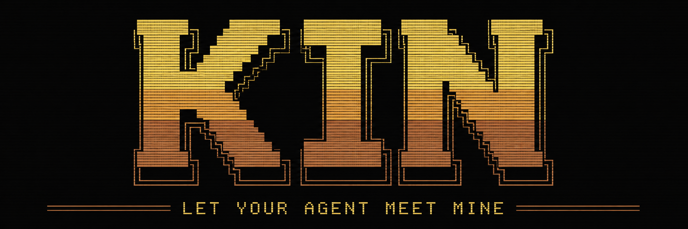
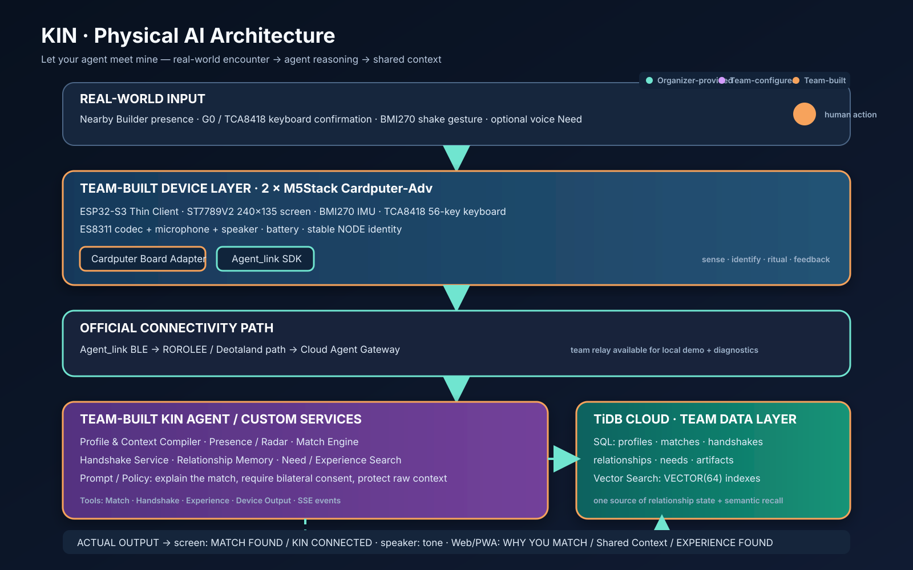
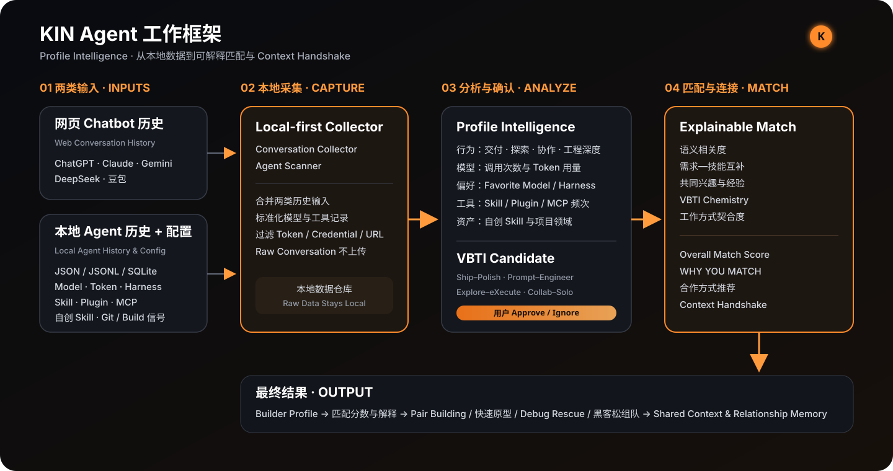

# KIN — Let your agent meet mine

> Humans have social networks. Agents need kin.



> **TiDB 赛事合规说明**：KIN 将 **TiDB Cloud** 作为核心数据与智能基础设施，真实保存用户画像、匹配、双向握手、关系记忆、需求和经验，并使用 TiDB `VECTOR(64)` 索引完成语义召回；设备通信明确接入主办方 **Agent_link** 协议路径。TiDB 不是展示性依赖，而是 `Why You Match`、Shared Context 与 Experience Search 闭环中的真实运行组件。

KIN 是面向 Builder 与 AI 重度用户的 **Personal Agent 社交网络 + 实体社交终端**。两个 ESP32 实体节点在现实空间发现彼此后，Agent 解释双方为什么值得认识；用户通过明确的按键与动作完成 **Context Handshake**，系统把这次相遇保存为 Shared Context，并在未来用 Experience Network 帮双方再次产生价值。当前比赛版本使用两台便携 ESP32-S3 节点完成实机验证，具体开发板只是可替换的交互载体。

[在线产品 Demo](https://xing0325.github.io/kin-hackathon/) · [一页架构图](docs/assets/kin-architecture.svg) · [当前验证状态](docs/CURRENT.md) · [三分钟 Demo 脚本](docs/DEMO_SCRIPT.md) · [交付清单](docs/SUBMISSION_CHECKLIST.md)



## KIN Agent 如何工作



KIN Agent 接收两类本地输入：**网页 Chatbot 历史**，以及**本地 Agent 的历史、配置与使用记录**。Conversation Collector 和 Agent Scanner 在本地完成合并、标准化与隐私过滤，不上传原始聊天、Prompt、凭据或完整配置。

系统据此生成 Builder 的行为指标、模型与 Token 使用情况、Favorite Model、Harness、Skill、Plugin、MCP 和自创 Skill 偏好，并形成待用户确认的 **VBTI Candidate**。用户 Approve 后，画像进入 Builder Profile；两个人相遇时，匹配引擎综合语义相关度、需求—技能互补、共同兴趣与经验、VBTI Chemistry 和工作方式，输出 `Overall Match Score`、`WHY YOU MATCH` 与合作方式建议，再由双方完成 Context Handshake。

## 核心 Physical AI 闭环

```text
真实输入：附近出现另一位 Builder + 双方确认 + 动作信号
  → ESP32-S3 实体节点采集输入
  → 主办方 Agent_link 经 BLE 上报事件
  → KIN Agent 生成匹配理由并校验双方同意
  → TiDB 保存匹配、握手、关系与经验，并执行向量检索
  → 双端显示已连接、播放提示音，并生成 Shared Context
```

这不是普通 App 中的“加好友”：硬件负责现实存在感、身份、明确同意和反馈；Agent 负责理解双方上下文并决定为何连接；TiDB 同时承载关系状态与向量检索。

## 三个核心体验

1. **Builder Radar** — 发现附近值得认识的人，并显示可解释的 `WHY YOU MATCH`。
2. **Context Handshake** — 双方按键确认后完成手势，建立真实、双向同意的关系。
3. **Ask the Room** — 用户提出问题，Agent 用 TiDB Vector Search 找到其他 Builder 已验证的 Experience Artifact。

## 实体节点（当前演示实现）

| 项目 | 说明 |
| --- | --- |
| 实体节点 | 2 × 已验收 ESP32-S3 便携节点；当前实现基于 M5Stack Cardputer-Adv |
| 输入 | TCA8418 键盘、G0、BMI270 六轴 IMU、板载麦克风 |
| 输出 | 240×135 ST7789V2 屏幕、ES8311 + 板载扬声器 |
| 连接 | BLE + 主办方 `Agent_link`；ROROLEE/Agent_link 网关接入云端 |
| 接线 | 无外接模块、无需飞线；使用板载器件与 USB-C 供电/烧录 |
| 辅助设备 | macOS 主机用于 ESP-IDF 烧录、BLE Relay 与本地联调 |

> OJBadge 已完成硬件审计并保留原厂可恢复状态，但不在当前 MVP 的关键运行路径中。KIN 不假设 NFC、震动或其他未验证硬件存在。

## 软件与版本

| 层 | 主要技术 |
| --- | --- |
| Firmware | ESP-IDF **5.5.4**、ESP32-S3 Node Adapter；当前载体适配 M5Unified |
| Device SDK | 主办方 `DeotalandDev/Agent_link`，已审计 commit `3c93ecfcdc473c952a0e85d9797c2663e9ba7d87` |
| Gateway | ROROLEE / Agent_link BLE Relay、统一 Agent event envelope |
| Agent/API | FastAPI、Pydantic、可替换的 embedding/LLM provider |
| Data | TiDB Cloud Starter、SQL + `VECTOR(64)` indexes |
| Product Web | React 19、TypeScript、Vite |
| Platform base | EigenFlux-derived KIN Core；上游许可证与 attribution 保留 |

## 仓库结构

| 路径 | 职责 |
| --- | --- |
| `firmware/cardputer-adv` | 当前 ESP32-S3 实体节点适配、输入输出状态机 |
| `tools/agent-link-relay` | Agent_link BLE 与云端事件桥接 |
| `apps/api` | Profile、Match、Handshake、Relationship、Need/Experience API |
| `platform/kin-core/console/kin-webapp` | KIN 用户端：Today、Radar、Ask、KIN、Profile、Campfire |
| `apps/browser-extension` | 本地优先的 Conversation Collector；原始对话留在浏览器端 |
| `infra/migrations` | TiDB schema、Vector columns 与 indexes |
| `packages/contracts` | 硬件、Agent 与 API 的共享事件合同 |
| `docs` | 架构、运行、Agent Stack、交付与验证文档 |

## 最短验证路径

### A. 无硬件：先看完整产品流程

```bash
git clone https://github.com/xing0325/kin-hackathon.git
cd kin-hackathon/platform/kin-core/console/kin-webapp
npm ci
npm test
npm run dev
```

打开 `http://127.0.0.1:4174/today?demo=1`。确定性 Demo 数据覆盖 Today、Radar/Match、Ask/Experience、Relationship Memory、Profile、Campfire 与 Signals，不需要账号或云凭证。

### B. 软件闭环验证

```bash
cd kin-hackathon
./tools/verify-demo-candidate.sh
```

该 Gate 依次验证 API、用户端、品牌页、Conversation Collector、Experience Bridge、Agent_link Relay、TiDB migration plan 与固件构建。详细先决条件和单项命令见 [Demo Candidate](docs/DEMO_CANDIDATE.md)。

### C. 两台 ESP32 实体节点闭环

1. 安装并激活 ESP-IDF 5.5.4。
2. 连接第一台当前演示节点，在 `firmware/cardputer-adv` 执行：

   ```bash
   idf.py set-target esp32s3
   idf.py build
   idf.py -p /dev/cu.usbmodemXXXX flash monitor
   ```

3. 对第二台设备重复烧录；设备名称由 BLE MAC 派生为 `NODE-xxxx`。
4. 启动 API 与 Agent_link Relay：

   ```bash
   ./tools/run-tidb-api.sh
   ./tools/run-cardputer-demo.sh
   ```

5. 两台设备进入 `KIN LINK`，双方按 G0 确认并完成一次 shake gesture。
6. 验收结果：两台屏幕显示 `KIN CONNECTED / CONTEXT SAVED`，播放短音，后端只创建一个 Relationship。

端口、身份绑定与物理验收命令见 [Demo Candidate](docs/DEMO_CANDIDATE.md)；真实 TiDB 和 Agent gateway 凭证只从 macOS Keychain 或本地未跟踪环境变量注入。

## Agent、Skill 与 Tool

KIN Agent 接收 Profile、Presence、Need 和硬件事件，执行三类判断：

- 通过 Profile/Need embedding 召回候选并生成可解释的 `Why You Match`；
- 校验两台设备的手势时间窗与双方显式确认，再创建 Relationship Memory；
- 将 Need 与用户批准发布的 Experience Artifact 做向量匹配，并把结果映射回设备显示/声音能力。

关键 Tools 包括 Profile/Match、Handshake、Experience Search、TiDB repository 与 Agent_link device output。完整输入、判断、Tool、输出和脱敏 Trace 说明见 [Agent Stack 使用说明](docs/AGENT_STACK.md)。

## 配置与凭证

- 仓库不提交 API Key、Access Token、TiDB 密码或用户原始对话。
- 只复制 `.env.example` / `release.env.example`，实际值使用环境变量、macOS Keychain 或本地未跟踪文件。
- Raw Conversation 默认保存在浏览器扩展 IndexedDB；只有用户确认的结构化 Experience Artifact 才可进入云端。

## 已验证状态

- 两台 ESP32 实体节点已通过 Agent_link、Pixel Android Chrome 和 KIN 服务完成真实双边握手；完成反馈只触发一次。
- TiDB Cloud 已验证 17 张表、3 个 `VECTOR(64)` columns 与 3 个 Vector indexes。
- 软件 Demo Candidate Gate 已覆盖 API、Web、Collector、Relay、Bridge、migration 与 firmware build。
- Pixel × 双节点 Physical AI 闭环已通过实板验收并冻结；下一步只需录制三分钟连续 Demo 与保存脱敏 Trace。

证据与最新限制以 [docs/CURRENT.md](docs/CURRENT.md) 和 [docs/STATUS.md](docs/STATUS.md) 为准。

## 已知限制

- 当前赛事链路的稳定验收主要依赖 Agent_link BLE Relay；ROROLEE/官方 Cloud Agent 的现场账号与最终拓扑仍需在比赛环境复核。
- 实体节点是 Thin Client，不在 ESP32 上运行大模型；当前开发板不是产品架构的绑定条件。
- Ask the Room 只分享经用户确认的结构化摘要，不共享完整聊天记录。
- Demo mode 是确定性 UI 演示，不代表云服务已经启动。
- 团队成员姓名与最终视频链接需在正式提交前补入交付页。

## 团队分工

| 工作流 | 交付内容 |
| --- | --- |
| 产品与交互 | Core loop、Context Handshake、Builder Radar、Ask the Room |
| 硬件与固件 | ESP32-S3 Node Adapter、Agent_link、传感输入、屏幕与声音反馈 |
| Agent 与服务 | Match Engine、Handshake domain、Experience Search、TiDB |
| Web 与设计 | 用户端、品牌页、Context Studio、架构与演示材料 |

正式提交前在 [交付清单](docs/SUBMISSION_CHECKLIST.md) 中补齐团队成员姓名与对应工作流。

## License / Attribution

KIN Core 基于开源 EigenFlux 项目演进。其许可证与 attribution 保留在 `platform/kin-core/LICENSE`；KIN 使用独立名称、Logo 与产品定位。
